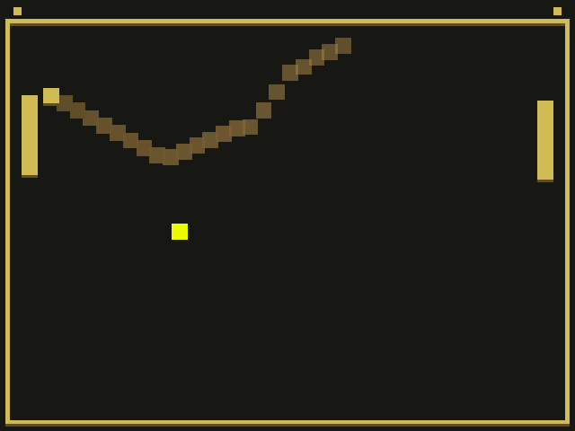

# Drift

Author: Jiasheng Zhou <jiashen2@andrew.cmu.edu>

Design: 
In the game, you can control the ball when it's your turn and pick up items to enhance your paddle or accelerate the ball.

Screen Shot:

How To Play:

Goals: Get the most points!

Controls:
W: Move the ball up when it's your turn
S: Move the ball down when it's your turn
Mouse: Control paddle position

Items:
1. Yellow cube: speed up the ball by 50% for 3 seconds.
2. Red cube: shorten your paddle by 0.5 unit for 3 seconds.
3. Green cube: extend your paddle by 0.5 unit for 3 seconds.

This game was built with [NEST](NEST.md).
